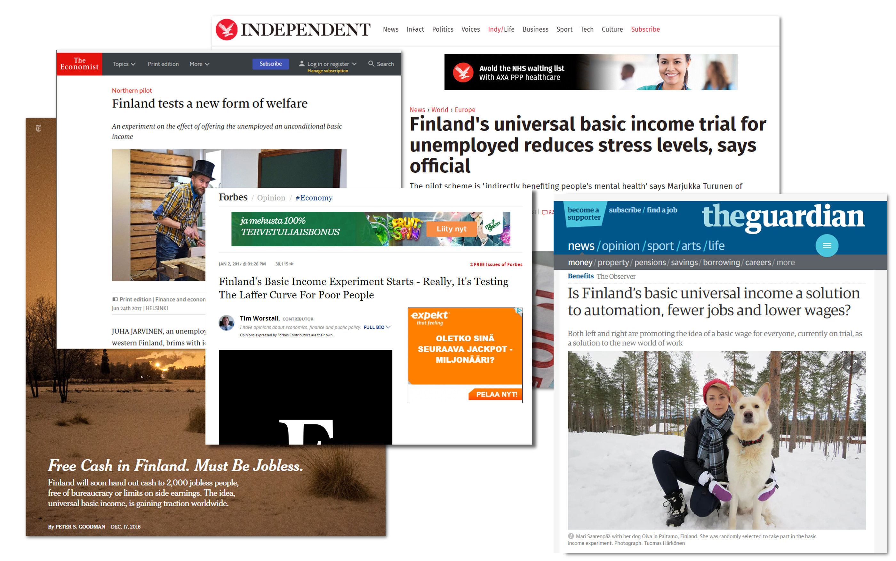
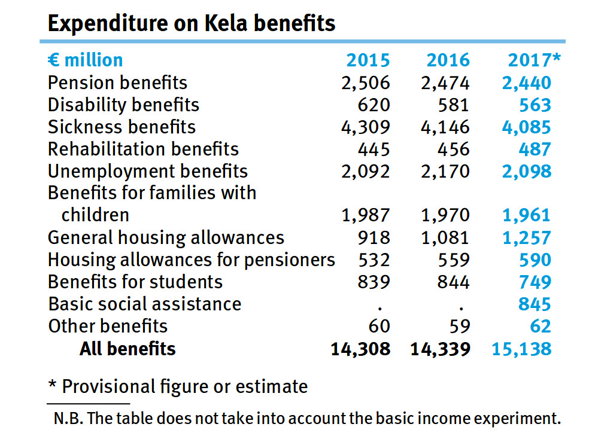

## rOpenGov

- **We are** loose community of R enthusiasts from academia, business and government
- **We work** to build and maintain tools for their own work
- **We aim** at building community to develope and maintain tools collaboratively
- [ropengov.github.io](http://ropengov.github.io/)

See talk by [Leo Lahti](http://antagomir.github.io/) **today 5:50pm - 5:55pm room 3.02**

## The Social Insurance Institution of Finland

<!--  -->

## The Social Insurance Institution of Finland

- backbone of Finnish welfare state, [distributes social benefits worth of 15 billion €](https://helda.helsinki.fi/bitstream/handle/10138/187398/Pocket_Statistics_2017.pdf?sequence=5)
- register data on many aspects of all Finnish individuals and families
- First Finnish SAS customer in 1984, now migrating into R after major data warehousing reform
- Need to integrate R for research, IT and statistics production

<!-- 
My responsibilities related to R:

- building internal R infrastructure and system integration,
- development of reporting 
- internal package development
- R training
- Summary: very little time to dedicate for teaching, but wide user base is a precondition for the infrastructure to be useful  
-->

<!-- questions for audience

- anyone in similar situation - need to teach R, but has time constraints...?

-->

## We ran 12 week course for researchers

- 12 week introduction to applied data analysis with focus in *tidyverse* for data analysis and *zeligverse* for statistics ([R for data science](http://r4ds.had.co.nz/) as text book)
- Two introductory classroom lectures and ten thematical online lectures (material from webinars, video lectures, text book chapters, learning platforms, QA-sites etc.) with homework assignments followed by feedback session 
- targeting experienced and very busy researchers (economists, sociologists, statisticians) with strong background in statistical thinking, but less in computation or R
- aiming at providing a "working knowledge" of R and integrating R into daily work for at least some tasks

## Lessons learned

### from students

- more about basics of coding (vs. gui) and R 
- more, easier and better tailored exercises
- commonly solved problems and commonnly used datasets
- less idealogical bs

### From instructors

- very few managed to integrate R, need for follow-up and redesigning the course
- language is important, many it-terms unclear even in your own language, not to mention in English
- know your students better, discuss in detail how they work with data
- even simple exercises are labor intensive to construct, not to mention domain spesific, relevant and gradually intensifying
- assessing the assignments and provind feedback takes time
- process of constructing and assessing assignment has to be better facilitated

<!-- ## Common bottlenecks in learning R -->

<!-- - An essential pedagogical feature of R is that it enables a problem-centered, interactive learning approach. Even programming-naive learners can, in our experience, rapidly adopt practical skills by analyzing topical example data sets supported by ready-made Rmarkdown templates; these can provide an immediate starting point to expose the learners to some of the key tools and best practices [@Wilson2016].  -->
<!-- - Indeed, at all levels of learning, getting things done fast, appears to be an essential component for successful learning as it provides instant rewards and helps to put the acquired skills into immediate use.  -->

<!-- The diverse needs of different application domains pose a great challenge for crafting common guidelines and materials, however. Leveraging the existing experience within the learning community can greatly support the learning process as it helps to ensure the domain specificity and relevance of the teaching experience.  -->

<!-- This can be supported by peer support and knowledge sharing; some ways to achieve this include code review, show-and-tell culture, informal meetings, online channels (e.g. Slack, IRC, Facebook) and hackathons.  -->

<!-- - Last but not least having fun throughout the learning process is essential; gamification of assignments with real-time rankings or custom functions performing non-statistical operations like emailing gif images can raise awareness of how R as a full-fledged programming language differs from proprietary statistical packages.  -->

<!-- - In order to meet these demands, we designed specific open infrastructure to support learning in R. Our infrastructure gathers a set of modules to construct domain spesific assignments for various phases of data analysis. The assignments are coupled with automated evaluation and scoring routines that provide instant feedback during learning.  -->

## edu: An open framework for creating and assessing exercises for R courses

### 1. Creating assignments

This packages provides an Rstudio addin for creating assignments for students with simple R exercises. See vignette: [creating assignments](https://ropengov.github.io/edu/articles/a_creating_assignments.html).

### 2. Assessing assgnments

In addition to creating assignments, there is also simple script for processing the completed assignments collected from students into a single script accompanied with the correct answers. See vignette: [assessing assignments](https://ropengov.github.io/edu/articles/b_assessing_assignments.html)

### 3. Manipulating existing and adding new exercises

You can use the pre-existing exercises covering multiple themes or you can easily create your own spesific to your organization. Package also has a simple support for different languages. See vignette: [manipulating exercises](https://ropengov.github.io/edu/articles/c_manipulating_exercises.html)

## Conclusion - on teaching

- teaching professional (colleagues) vs. students different, ie 
    - time constraints, critical
    - unlearning prior/while learning
    - direct benefits (if colleagues)
- be generic, but try using familiar datasets when possible
- have fun, be creative and silly
- different target levels (further you are, the more able you are to learn by themselves)
    1. understands the potential of programming & automation in his/her work
    2. can execute, edit and test documented examples
    3. write and test code independently for basic data analysis problem
    4. can solve complex analytical problems, test and share code as R-packages

## Conclusion - on framework

- contributions of any kind welcome
- package developers could add exercises for their packages

